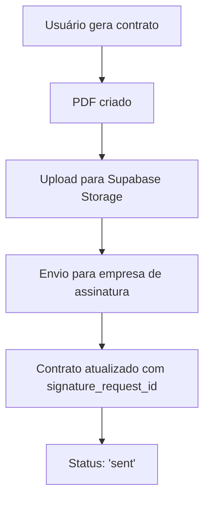
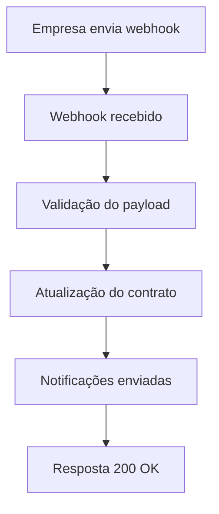

# 📝 Integração com Assinatura Eletrônica - Master Brasil

## 🎯 **WEBHOOK CONFIGURADO**

### **URL do Webhook:**
```
https://diopahhcwhdasextobav.supabase.co/functions/v1/signature-webhook
```

### **Método:** `POST`
### **Content-Type:** `application/json`

---

## 🔧 **CONFIGURAÇÃO NECESSÁRIA**

### **1. Variáveis de Ambiente**
Configure no painel da empresa de assinatura:

```env
# URL do webhook (obrigatório)
WEBHOOK_URL=https://diopahhcwhdasextobav.supabase.co/functions/v1/signature-webhook

# Chave secreta para validação (opcional, mas recomendado)
WEBHOOK_SECRET=sua_chave_secreta_aqui

# Configurações da API da empresa de assinatura
SIGNATURE_API_URL=https://api.sua-empresa.com/v1
SIGNATURE_API_TOKEN=seu_token_aqui
```

### **2. Headers Obrigatórios**
A empresa de assinatura deve enviar:

```http
Content-Type: application/json
X-Signature: sha256=hash_hmac_sha256 (opcional, para segurança)
```

---

## 📋 **PAYLOAD DO WEBHOOK**

### **Estrutura Esperada:**
```json
{
  "event": "document_signed",
  "document_id": "doc_123456",
  "signature_request_id": "req_789012",
  "status": "signed",
  "signed_at": "2025-01-15T10:30:00Z",
  "signer": {
    "name": "João Silva",
    "email": "joao@email.com",
    "cpf": "12345678901",
    "signed_at": "2025-01-15T10:30:00Z"
  },
  "document": {
    "name": "contrato_locacao_123.pdf",
    "url": "https://original-url.com/doc.pdf",
    "signed_url": "https://signed-url.com/doc_signed.pdf"
  },
  "metadata": {
    "rental_id": "rental_uuid",
    "contract_id": "contract_uuid",
    "city_id": "city_uuid"
  }
}
```

### **Eventos Suportados:**
- `document_sent` - Documento enviado para assinatura
- `signer_signed` - Um signatário assinou
- `document_signed` - Todos assinaram (documento completo)
- `document_rejected` - Documento rejeitado
- `document_expired` - Documento expirado

### **Status Possíveis:**
- `pending` - Aguardando assinatura
- `signed` - Assinado completamente
- `rejected` - Rejeitado
- `expired` - Expirado
- `cancelled` - Cancelado

---

## 🔄 **FLUXO DE INTEGRAÇÃO**

### **1. Geração do Contrato**


### **2. Processo de Assinatura**


---

## 🛠️ **IMPLEMENTAÇÃO TÉCNICA**

### **Arquivos Criados/Modificados:**

1. **`supabase/functions/signature-webhook/index.ts`**
   - Função Edge do Supabase para receber webhooks
   - Processa eventos de assinatura
   - Atualiza status dos contratos

2. **`src/services/digitalSignatureService.ts`**
   - Integração com empresa de assinatura
   - Upload de documentos para Supabase Storage
   - Criação de solicitações de assinatura

3. **`setup_storage_bucket.sql`**
   - Configuração do bucket de storage
   - Políticas de acesso aos documentos

### **Banco de Dados:**
- Tabela `generated_contracts` já configurada
- Campo `signature_request_id` para rastreamento
- Campo `pdf_url` para documento assinado
- Campo `status` atualizado via webhook

---

## 🔐 **SEGURANÇA**

### **Validação de Webhook:**
- Verificação de assinatura HMAC-SHA256 (opcional)
- Validação de payload obrigatório
- Headers CORS configurados

### **Políticas de Storage:**
- Upload: Apenas usuários autenticados
- Visualização: Apenas usuários autenticados
- Exclusão: Apenas administradores

---

## 📊 **MONITORAMENTO**

### **Logs Disponíveis:**
- Supabase Edge Functions logs
- Console do navegador (desenvolvimento)
- Logs da empresa de assinatura

### **Verificação de Status:**
```sql
-- Ver contratos enviados para assinatura
SELECT 
  id,
  contract_number,
  status,
  signature_request_id,
  signed_at,
  created_at
FROM generated_contracts 
WHERE signature_request_id IS NOT NULL
ORDER BY created_at DESC;
```

---

## 🚀 **PRÓXIMOS PASSOS**

### **Para a Empresa de Assinatura:**
1. ✅ Configurar webhook URL: `https://diopahhcwhdasextobav.supabase.co/functions/v1/signature-webhook`
2. ✅ Configurar eventos para envio
3. ✅ Testar integração com documento de exemplo
4. ✅ Configurar chave secreta (opcional)

### **Para o Sistema:**
1. ✅ Deploy da função webhook
2. ✅ Configuração do bucket de storage
3. ✅ Teste de geração e envio de contratos
4. ✅ Configuração de notificações por email

---

## 📞 **SUPORTE**

Em caso de problemas:
1. Verificar logs da função Edge no Supabase
2. Verificar configuração do webhook na empresa
3. Testar payload manualmente
4. Verificar políticas de RLS nas tabelas

**Webhook está pronto para receber integrações!** 🎉
